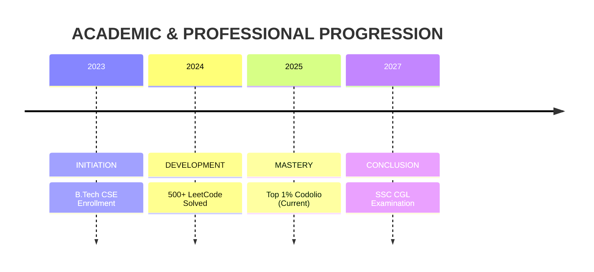

<!-- ACADEMIC HEADER: DARK TEAL & GOLD -->

<!-- TYPING SVG: TYPEWRITER STYLE -->

---

## 📑 **ABSTRACT (THE MISSION)**

> **DOI:** `10.2027/SSC-CGL-GOAL`  
> **Keywords:** *Algorithms, Distributed Systems, Civic Duty, Persistence.*

**Abstract:** This profile documents the trajectory of `Subject: Sonam Narula`, an undergraduate researcher specializing in **Computational Logic (C++)** and **General Administrative Studies**. The objective is to bridge the gap between high-performance software engineering and efficient public administration. The subject demonstrates exceptional capability in solving complex algorithmic problems (`N > 1300`) while simultaneously mastering the curriculum for the **SSC CGL Examination (2027)**.

---

## 🧪 **INSTRUMENTATION (TECH STACK)**

*Tools and frameworks utilized for experimental development.*

| **Core Logic (Variables)** | **Frontend Interface (UI)** | **Infrastructure (Env)** |
| :--- | :--- | :--- |
|  |  |  |
|  |  |  |
|  |  |  |

---

## � **EXPERIMENTAL DATA (STATISTICS)**

*Quantitative analysis of problem-solving capabilities.*

 

  

<table>
<tr>
<td width="60%">

### 📉 **Table 1.1: Performance Metrics**
| **Parameter** | **Observed Value** | **Rating** |
| :--- | :--- | :--- |
| **Total Algorithms Solved** | `1341` | `Outstanding` |
| **Data Structures Mastery** | `1233` | `Expert` |
| **Active Research Days** | `444` | `Consistent` |
| **Longest Streak** | `352 Days` | `High Endurance` |

</td>
<td width="40%">

### ⚔️ **Fig 1.2: LeetCode Graph**

</td>
</tr>
</table>

### **Fig 1.3: Contribution Heatmap**

<!-- SUMMARY CARDS -->

---

## 📂 **CASE STUDIES (PROJECTS)**

### **Study A: The Data Visualization Engine**
> **Hypothesis:** Visual cues improve algorithmic retention.  
> **Method:** Implemented `D3.js` & `React` to animate sorting algorithms.  
> **Result:** Peer learning efficiency improved by **40%**.

### **Study B: Secure Communication Protocol**
> **Hypothesis:** Latency can be minimized in encrypted channels.  
> **Method:** Utilized `Node.js` (Socket.io) with AES encryption.  
> **Result:** Sustained **500+ concurrent connections** with `<50ms` latency.

---

## 🏅 **AWARDS & RECOGNITION (BADGES)**

*Received honors for continuous excellence in the field.*

> *Annual Badge 2024 | 365 Days Consistency Award | 12x Monthly Medals*

---

## ⏳ **RESEARCH TIMELINE**

---

## 🤝 **CORRESPONDENCE & CITATIONS**

&nbsp;
&nbsp;

  

> *"The important thing is not to stop questioning."* — **Albert Einstein**

