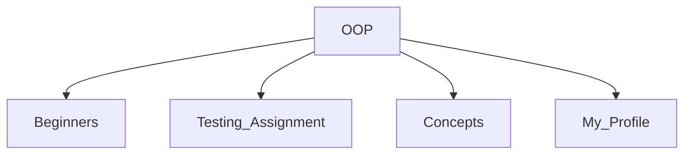

# ~/Object_Oriented_Programming 🧣

```cpp
// "It's a love story, baby, just say yes... to C++."
const string vibe = "Simple. Nerdy. Aesthetic.";
```

Welcome to my **OOP Collection**. This repository is curated like a perfect playlist—structured, emotional, and logically sound.

---

## 📂 File System (The Eras)



- **`Beginners/`** 💛 *The Debut*  
  Basic building blocks. `std::cout << "Hello World";`

- **`Testing_Assignment/`** 💜 *Speak Now*  
  `assert(code == clean);` // Identifying bugs.

- **`Concepts/`** 🧣 *Red*  
  Isolated examples of specific OOP topics.

- **`My_Profile/`** 💖 *Lover*  
  `class Me : public Developer {};`

---

## 🎧 The Tracklist (Concepts)

| Track | Concept | Lyric/Vibe |
| :--- | :--- | :--- |
| **01** | `class Object` | *"You belong with me."* |
| **02** | `private:` | *"Big Reputation." (Encapsulation)* |
| **03** | `class Child : Parent` | *"I'd be the man." (Inheritance)* |
| **04** | `virtual void()` | *"Look what you made me do." (Polymorphism)* |
| **05** | `~Desctructor()` | *"Closing the chapter."* |

---

## 💻 Usage

```bash
# Clone the era
git clone https://github.com/SonamNarula/C-WHOLE.git

# Enter the simulation
cd Object_Oriented_Programming/My_Profile

# Compile the aesthetic
g++ Me.cpp -o me && ./me
```

---

> *"Long live all the magic we made."* 🪄  
> `return 0;`
